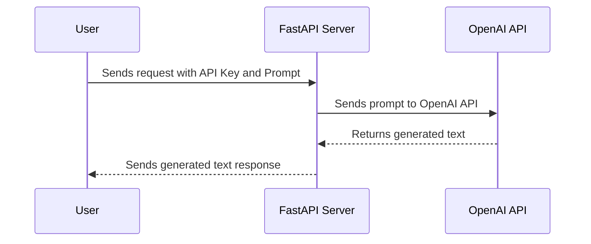
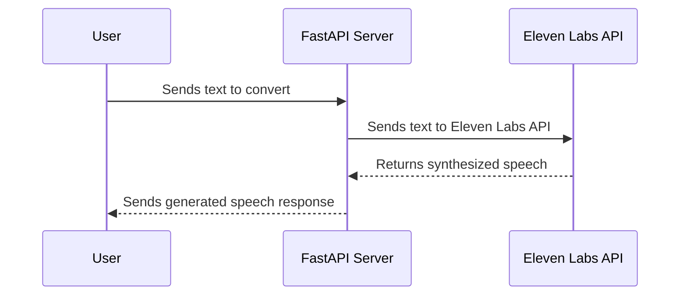
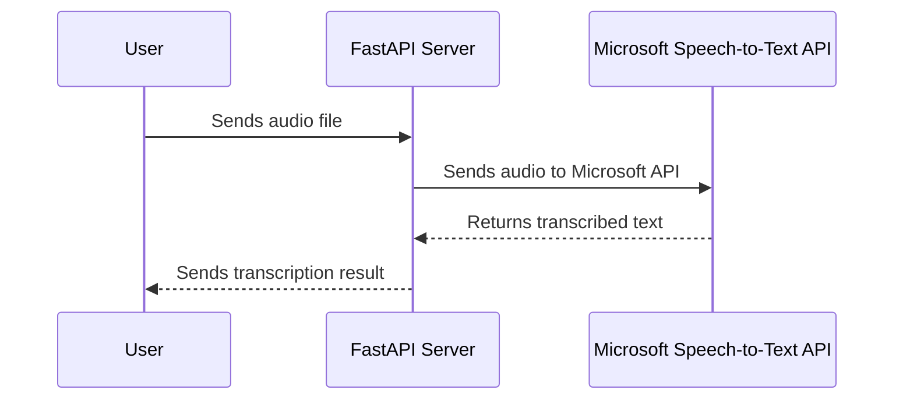
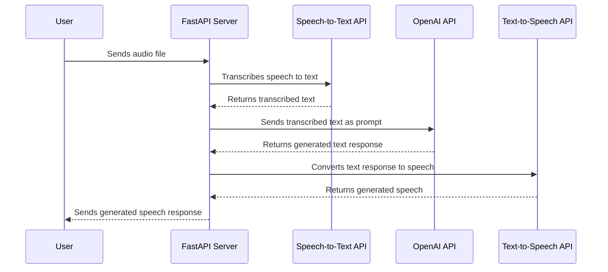

### All-In-One AI Service README

#### Overview
The **All-In-One AI Service** is a REST API that integrates multiple AI functionalities, including Text Generation, Text-to-Speech, Speech-to-Text, and Voice-to-Voice interaction. The service acts as a proxy to OpenAI, Eleven Labs, and Microsoft's Speech-to-Text API, providing seamless integration of these services while offering flexible API key management for controlled access.

This server offers:
- **Text Generation** using OpenAI's language models.
- **Text-to-Speech** conversion via Eleven Labs API.
- **Speech-to-Text** transcription using Microsoft's Speech-to-Text API.
- **Voice-to-Voice** interaction that combines speech transcription, text generation, and speech synthesis into a seamless interaction loop.

It supports flexible API key management and optional database integration for tiered access control and user-specific configurations.

#### Setup
To set up and run the service, follow these steps:

1. **Python Installation**: Ensure that Python 3.8+ is installed on your machine.
2. **Dependency Installation**: Install the required Python packages by running:
   ```bash
   pip install fastapi uvicorn pydantic python-dotenv openai requests
   ```
3. **Environment Configuration**: Create a `.env` file in the root directory of your project and define the following variables:
   - `OPENAI_API_KEY`: Your OpenAI API key.
   - `ELEVEN_LABS_API_KEY`: Your Eleven Labs API key.
   - `MICROSOFT_SPEECH_KEY`: Your Microsoft Speech-to-Text API key.
   - `MICROSOFT_REGION`: Your Microsoft Speech-to-Text region.
   - `PROXY_API_KEY`: A custom API key for accessing this proxy server.

#### Running the Server
To start the server, run the following command:

```bash
uvicorn main:app --host 0.0.0.0 --port 8000
```

#### Endpoints Overview
The service provides the following endpoints:

1. **Text Generation** (`/generate-text/`): Sends a prompt to the OpenAI API to generate a text response.
2. **Text-to-Speech** (`/text-to-speech/`): Converts text input into speech using the Eleven Labs API.
3. **Speech-to-Text** (`/speech-to-text/`): Converts an audio file into text using Microsoft's Speech-to-Text API.
4. **Voice-to-Voice** (`/voice-to-voice/`): Converts speech input into text, generates a response using OpenAI, and synthesizes the response back into speech.

---

### API Usage

#### 1. Generate Text
Generates a text response from OpenAI's model based on the provided prompt.

- **Endpoint**: `/generate-text/`
- **Method**: `POST`
- **Headers**:
  - `Content-Type: application/json`
  - `x-api-key: your-api-key-here`
- **Request Body**:
  ```json
  {
      "prompt": "Your text prompt here"
  }
  ```
- **Response**:
  ```json
  {
      "response": "Generated response from the LLM"
  }
  ```

**Mermaid Diagram**:



#### 2. Text-to-Speech
Converts text into speech using the Eleven Labs API.

- **Endpoint**: `/text-to-speech/`
- **Method**: `POST`
- **Headers**:
  - `Content-Type: application/json`
  - `x-api-key: your-api-key-here`
- **Request Body**:
  ```json
  {
      "prompt": "Your text to convert to speech"
  }
  ```
- **Response**: Streaming audio in MPEG format.

**Mermaid Diagram**:



#### 3. Speech-to-Text
Transcribes speech into text using Microsoft's Speech-to-Text API.

- **Endpoint**: `/speech-to-text/`
- **Method**: `POST`
- **Headers**:
  - `x-api-key: your-api-key-here`
- **Request Body**: Form-data containing the audio file.
  ```bash
  --form "file=@path_to_audio_file.wav"
  ```
- **Response**:
  ```json
  {
      "transcription": "Transcribed text from speech"
  }
  ```

**Mermaid Diagram**:



#### 4. Voice-to-Voice
Processes speech input, generates a response, and returns synthesized speech.

- **Endpoint**: `/voice-to-voice/`
- **Method**: `POST`
- **Headers**:
  - `x-api-key: your-api-key-here`
- **Request Body**: Form-data containing the audio file.
  ```bash
  --form "file=@path_to_audio_file.wav"
  ```
- **Response**: Streaming audio of the generated voice response.

**Mermaid Diagram**:



---

### Example Curl Commands

**Generate Text**:
```bash
curl -X POST http://127.0.0.1:8000/generate-text/ \
    -H 'Content-Type: application/json' \
    -H 'x-api-key: your-api-key-here' \
    -d '{"prompt": "Your text prompt"}'
```

**Text-to-Speech**:
```bash
curl -X POST http://127.0.0.1:8000/text-to-speech/ \
    -H 'Content-Type: application/json' \
    -H 'x-api-key: your-api-key-here' \
    -d '{"prompt": "Your text"}'
```

**Speech-to-Text**:
```bash
curl -X POST http://127.0.0.1:8000/speech-to-text/ \
    -H 'x-api-key: your-api-key-here' \
    -F "file=@path_to_audio_file.wav"
```

**Voice-to-Voice**:
```bash
curl -X POST http://127.0.0.1:8000/voice-to-voice/ \
    -H 'x-api-key: your-api-key-here' \
    -F "file=@path_to_audio_file.wav"
```

---

### License
This project is licensed under the Artistic License 2.0. The full text of the license can be found [here](https://huggingface.co/datasets/choosealicense/licenses/blob/main/markdown/artistic-2.0.md).
