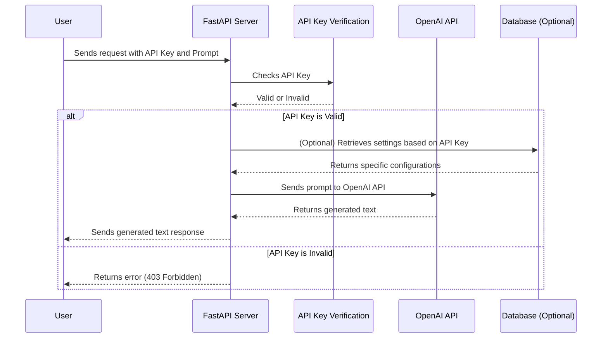

---

### OpenAI_Proxy_Server README

#### Overview
The OpenAI_Proxy_Server is a REST API proxy designed to facilitate secure and controlled access to OpenAI's services. It offers capabilities for local hosting, gate-kept access, and tiered prompt access control that can be customized for different users or services based on the provided API key. This proxy can integrate with a database to retrieve various configurations based on the API key, offering flexibility for creative implementations.

#### Setup
To get the server running, you will need to set up a few things:

1. **Python Installation**: Ensure that Python 3.8+ is installed on your machine.
2. **Dependency Installation**: Install the required Python packages by running:
   ```
   pip install fastapi uvicorn pydantic python-dotenv openai
   ```
3. **Environment Configuration**: Create a `.env` file in the root directory of your project and define the following variables:
   - `OPENAI_API_KEY`: Your OpenAI API key.
   - `PROXY_API_KEY`: A custom API key for accessing this proxy server.

#### Running the Server
Execute the following command to start the server:
```
uvicorn main:app --host 0.0.0.0 --port 8000
```

#### Usage
To interact with the proxy server, you can make HTTP POST requests. Here is an example using `curl` to send a request to the server:

```bash
curl -X POST http://127.0.0.1:8000/generate-text/ \
    -H 'Content-Type: application/json' \
    -H 'x-api-key: Jayesh' \
    -d '{"prompt": "Tell me a short story about a brave knight."}'
```

This command sends a request to generate text based on the provided prompt, using the API key "Jayesh" for authentication.

#### License
This project is licensed under the Artistic License 2.0. Here is a summary with a link to the full text:

**Artistic License 2.0**
- The intent of this document is to state the conditions under which a Package may be copied.
- A "Package" refers to the collection of files distributed by the Copyright Holder, and derivatives of that collection of files created through textual modification.
- "Standard Version" refers to such a Package if it has not been modified, or has been modified in accordance with the wishes of the Copyright Holder.
- The License describes the terms under which the Copyright Holder will allow you to distribute the Package in aggregate with other (possibly commercial) programs as a larger work.

For more details on the license, please see the [full text of the Artistic License 2.0](https://huggingface.co/datasets/choosealicense/licenses/blob/main/markdown/artistic-2.0.md).

Here's a Mermaid diagram that captures the essence of how your program works, detailing the flow from the user making a request through the API key verification to the interaction with the OpenAI API:



### Explanation of Diagram Components:
- **User (U)**: The user sends a request to the FastAPI server including the prompt and the API key.
- **FastAPI Server (S)**: Receives the user's request and passes the API key to the API Key Verification component.
- **API Key Verification (V)**: Validates the provided API key. If the key is valid, the process continues; if not, it returns an error to the user.
- **OpenAI API (O)**: If the API key is valid and optional settings are retrieved, the prompt is sent to OpenAI's API, which then returns the generated text.
- **Database (D)**: Optionally involved for fetching specific configurations based on the API key. This is conceptual and can be implemented if there are different levels or types of access or settings per API key.

---
